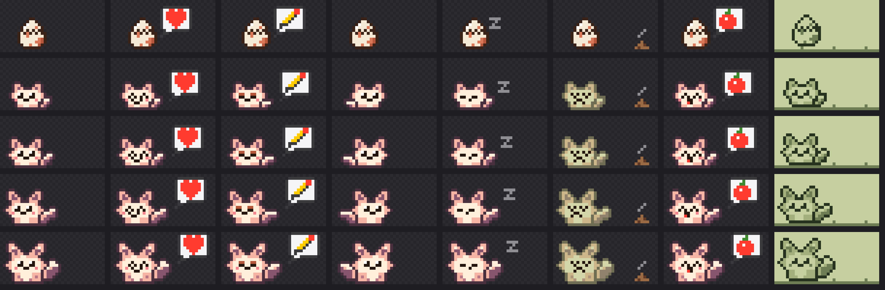

English | [简体中文](README.zh-CN.md)

# pixipet

A pixel pet that lives inside Claude Code, in the spirit of the handheld virtual pets of the '90s. It watches what Claude is doing, grows up on Claude's work, and keeps you company while you code.

A pixel creature drawn with half-block cells (two pixels per terminal cell), animated at ~5 fps straight into the terminal. Original art. The default species is **mallow**, a peach fox kit with petal ears and a tail that grows fluffier; `/pet species` switches to **sprig** (a cream chick with a leaf sprout), **dewdrop** (a dewdrop sprite in a curly drop hat), **plumcap** (a plum mushroom whose cap grows wavy), **luma** (a fuzzy moth with crescent-moon wings), **mossroll** (a snail carrying a mossy shell), **inkfold** (an origami cat folded from graphite paper), **kilnby** (a terracotta pup with a glazed bib), **tuck** (a shy ghost living in an old quilt) or **mochi** (the first design, a round orange blob).



## What it does

- **Watches Claude.** Every tool call becomes a line the pet understands: reading `foo.ts`, searching `TODO`, running `npm test`, delegating to a subagent, browsing `claude.com`. The pane shows the current activity, how long it has run and how many tools this turn used.
- **Grows with your work.** Each tool call is 1 XP, each finished turn 2 XP. Egg → baby (10) → child (60) → teen (200) → adult (500), with a toast at every evolution.
- **Needs care.** Food, mood and energy drift down over time; it poops now and then. Feed, play, clean, put it to bed, or let it keep its own hours: it dozes off when tired (energy under 20) or late at night (midnight to 6, energy under 50) and gets up rested after the night; woken by hand, it stays up half an hour. Three piles, or going hungry and sad at once, make it sick: it turns green, can't play, and needs its medicine (a `5: 💊Medicine` button appears while it is sick); cleaning alone doesn't cure it. Time away is capped (three piles at most, no stat below 15), so coming back is never cruel.
- **Keeps you company.** While Claude is idle it chats: late-night reminders to sleep, a nudge to drink water, cheers after a long turn, worry when a tool fails.
- **Bubbles show Claude's work.** A magnifier for reads and searches, a pencil for edits, a terminal for shell commands, a globe for the web, a list for plans, a mini pet for each subagent. A flashing red **!** when Claude is asking you something or waiting on a plan approval.
- **It reacts.** Hops and a ✓ when a turn lands, a sweat drop when a tool fails, munching when fed, hearts when played with, Zs when asleep, a flash when it evolves. It wanders around while Claude is idle and comes home when Claude starts working.
- **Speaks Chinese and English.** It follows Claude Code's `language` setting; `/pet lang zh|en` picks one.
- **Where to see it:** a pixel band above the prompt (or under it), and a pane (`/pet`); with the band hidden, the status line carries its stats instead. On desktop and other surfaces without pixels it falls back to text.

## Install

```sh
claude plugin marketplace add VibeMage/claude-mod-pet
claude plugin install pixipet@claude-mod-pet
```

Then start a new session (or run `/reload-plugins`) and type `/pet`.

To try it for one session without installing: `git clone https://github.com/VibeMage/claude-mod-pet && claude --plugin-dir ./claude-mod-pet`.

## Commands

Type `/pet` and everything is in its pane: care on the front, and **⚙ Settings** (press `o`) for species, placement, band, buttons, digit keys, skin, language, name and starting over, each a row of choices you click or Tab to. `/pet settings` opens straight there. The subcommands below are shortcuts for the same things.

| Command | |
| --- | --- |
| `/pet` | Open the pet pane (with the pane focused, `ctrl+x tab`: `f` feed, `p` play, `c` clean, `s` sleep/wake) |
| `/pet feed` · `play` · `clean` · `sleep` · `heal` | Care without opening the pane; `heal` gives medicine to a sick pet |
| `/pet status` | One-line stats |
| `/pet name <name>` | Rename the pet |
| `/pet band [full\|mini\|hidden]` | The band above the prompt: pixel scene (8 rows), one line, or off. Without an argument it cycles |
| `/pet place [above\|below]` | Put the band above the prompt (the default) or under it; the digit keys work only above it |
| `/pet buttons [on\|off]` | Show or hide the band's care buttons (`1: 🍓Feed` `2: 🎾Play` `3: 🧼Clean` `4: 🌙Sleep`, each a soft-coloured chip); hiding them saves a row and turns the digit keys off too |
| `/pet keys [on\|off]` | Digits in an empty prompt press the band's buttons: `1` feed, `2` play, `3` clean, `4` sleep. On by default; off gives the digits back to typing |
| `/pet species [id]` | Switch species: `mallow`, `sprig`, `dewdrop`, `plumcap`, `luma`, `mossroll`, `inkfold`, `kilnby`, `tuck`, `mochi`; without an id, list them |
| `/pet skin [color\|lcd]` | Colour pixels, or a retro handheld LCD screen in four greens |
| `/pet lang [zh\|en\|auto]` | The pet's language; `auto` follows Claude Code's `language` setting, English when it has none |
| `/pet reset confirm` | Start over from a new egg |

## What it reads, stores and sends

Everything stays on your machine. The pet makes no network requests and runs no commands.

- **Reads:** the tool calls and turns of the session (tool name, file names, a Bash command's description or the command itself, a search pattern, a fetched URL's host) to show what Claude is doing; Claude Code's `theme` and `language` settings. It reads no environment variables and no credentials.
- **Stores:** the pet's stats and your choices (band, buttons, keys, skin, species, language) in its own plugin store under `~/.claude/plugins/store/`. Nothing about your code or prompts is stored.
- **Shows:** a band above the prompt, a pane, a status line and toasts. It never changes or blocks a tool call, a prompt or Claude's answer.
- **Hooks:** `tool.call`, `turn.start` and `turn.complete` to follow what Claude does (each passed on unchanged); `prompt.submit` only to let a sleeping pet roll over when you write to Claude (the prompt is passed on unchanged); `command.run` to answer its own `/pet` command and nothing else; `session.start` / `session.end` to load and save the pet; `ui.render` for the band, the hint line and its pane.

## How it works

A Claude Code mod (function hooks plugin). `tool.call`, `turn.start` and `turn.complete` feed the activity; `$.clock.every` drives the animation (frames go to a `Raster` through `$.ui.blit`, no redraw) and the minute-by-minute life; `$.state` holds what the drawings read, `$.store` keeps the pet between sessions. Colours are the iOS system palette, light or dark with the Claude Code theme.

```
hooks/register.tsx   hooks, pane, band, commands
hooks/pet.ts         pure pet logic (stats, stages, care, tool → activity)
hooks/pixels.ts      pixel art: the creature, icons, bubbles, half-block packing
hooks/species/       the species as pixel bitmaps and their contract
hooks/text.ts        every word in Chinese and English
hooks/sprites.ts     text fallback for surfaces without pixels, and bars
types/index.d.ts     the $.state contract
tests/pet.test.ts    claude plugin test .
```

## Develop

```sh
claude plugin validate --strict .
claude plugin test .
npx -y tsx scripts/preview.ts all   # renders docs/species/<id>.png for every species
```

The concept art in `docs/concepts/` was generated with an image model (the prompts are in `docs/concepts/prompts*.json`, and the images keep their C2PA content credentials); the pixel bitmaps were drawn from it by hand-editing letters in `hooks/species/`.

New species are welcome: [docs/design-brief.md](docs/design-brief.md) is the brief the current ones were drawn from, and `hooks/species/types.ts` is the contract a test holds every species to.

## License

MIT
